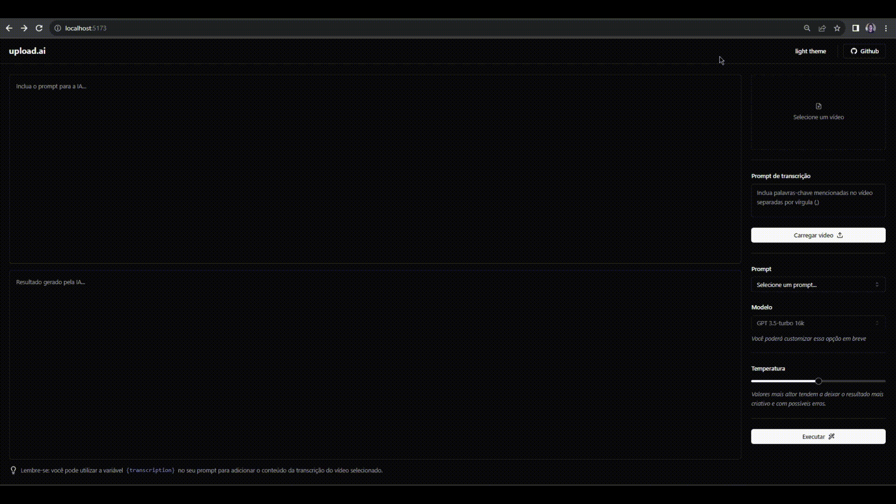

<h1 align="center">
   UploadAI
</h1> 

<div align="center">
  <b>
    <a href="#-Technologies"><b>Technologies</b></a>&nbsp;&nbsp;&nbsp;|&nbsp;&nbsp;&nbsp;
    <a href="#-Project"><b>Project</b></a>&nbsp;&nbsp;&nbsp;|&nbsp;&nbsp;&nbsp;
    <a href="#-Layout"><b>Layout</b></a>&nbsp;&nbsp;&nbsp;
  </b>  
</div>

---

<div align="center">
  
</div> 

</br>

## 🚀 Getting started

Clone the project and access the folder.

### Web

```bash
$ git clone https://github.com/diaspd/upload-ai.git
$ cd Web

# Install the dependencies
$ npm install

# Start the application
$ npm run dev

```
</br>

The app will be available on `http://localhost:5173`

### API

```bash
$ cd API

# Install the dependencies
$ npm install

# Make a copy of to '.env.local'
# Add OPENAI_KEY="use_your_openai_key_here"

# Start the server
$ npm run dev
````

The server will be available on `http://localhost:3333/`

<br>
</br>

## 💻 Technologies

This project was developed with the following technologies:
<b>
- OpenAI
- ReactJs
- NodeJs
- Typescript
- ShadcnUI
</b>

</br>

## 📄 Project
💰 A project that transcribes a video into audio, and then a description or title can be generated for the video using OpenAI API, reactjs, node.js and more.

<br></br>

Made with ♥ by Pedro Dias. 👋 Follow me on social media! </br>

If you can give a little star, I appreciate it 🤩
